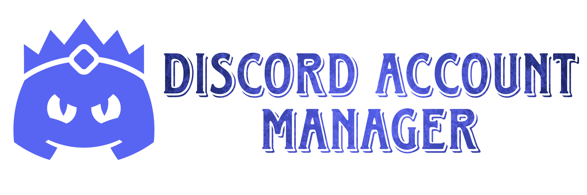

  

  Discord Account Manager is a modern browser extension that allows you to quickly switch between multiple Discord accounts, organize your accounts with folders, and securely log in using tokens.

  
  

---

# ✨ Features

- **🚀 Multi-Account Management:** Save an unlimited number of Discord accounts and switch between them with a single click.
- **🔍 Advanced Search:** Instant search among your accounts by username.
- **📁 Folder System:** Categorize your accounts (work, gaming, personal, etc.) for a more organized view.
- **⚡ Automatic Token Extraction:** Instantly add your account to the list by extracting the token from an open Discord tab with one click.
- **✅ Token Validation:** Bulk check if your saved tokens are still valid.
- **🌓 Theme Support:** Eye-friendly Dark Mode and Light Mode options.
- **🛡️ Security and Privacy:** Your tokens are only stored in your browser's local storage and are never sent to any server.

---

# 🛠️ Chrome Installation
1. [Click here](https://chromewebstore.google.com/detail/daibnnodfmdiodinihdmelconnbfgefo?utm_source=item-share-cb) to open the application page.
2. Install the application in your Chrome by clicking the **Add to Chrome** button. 

# 🛠️ Manual Installation

1. Download this repository to your local storage: [Discord Account Manager](https://github.com/lawerth/Discord-Account-Manager/archive/refs/heads/main.zip)
2. Open your browser (Chrome, Edge, or Brave) and navigate to the extensions page: `chrome://extensions`
3. Enable **Developer Mode** in the top right corner.
4. Click the **Load unpacked** button.
5. Select the main project folder you downloaded.

---

# ⚠️ Security Warning

This extension is open-source and designed for your security. However, **your Discord Token is just like your password.** Please do not share your tokens with anyone. The extension stores your data only in your local browser and does not perform any external data transfer.

---

# 📄 License

This project is licensed under the MIT License. See the `LICENSE` file for more information.
